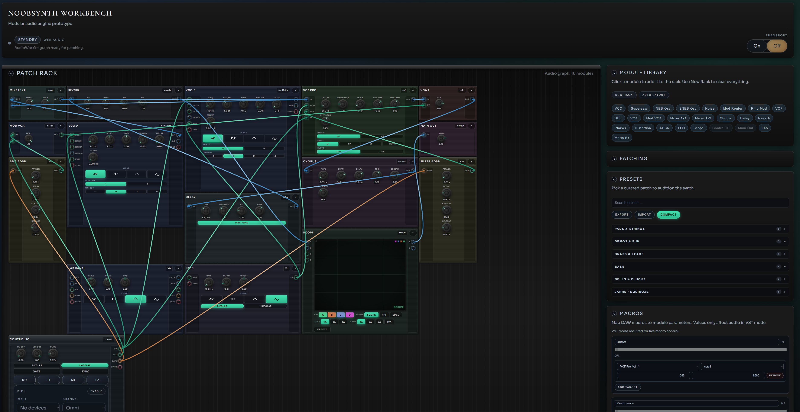

# NoobSynth3

Synthétiseur modulaire inspiré de VCV Rack, construit avec React + Rust/WASM.

**[Démo en ligne](https://ressources.warnotte.be/Projects/NoobSynth3/)**



## Caractéristiques

- **Interface Eurorack** : Rails, panneaux métal brossé, câbles patchables
- **69 modules** : VCO, Supersaw, Karplus-Strong, NES/SNES Osc, TB-303, FM Op, Shepard Tone, Pipe Organ, Spectral Swarm, Resonator, Wavetable, Granular Sampler, SID Player (C64), TR-909/808 Drums, Drum Sequencer (8-track), Euclidean Sequencer, MIDI File Sequencer, Turing Machine, Noise, Audio In, Sample & Hold, Slew, Quantizer, Chaos Engine, VCF (SVF/Ladder), LFO, ADSR, Step Sequencer, Arpeggiator, Ensemble/Choir, Delay/Tape/Granular, Spring/Reverb, Pitch Shifter, Wavefolder...
- **Polyphonie** : 1/2/4/8 voix avec voice stealing
- **MIDI** : Entrée Web MIDI avec vélocité
- **Presets** : 100+ patches inclus (Jupiter, Juno, Moog, Prophet, Jarre, Acid, Moroder, 909, Shepard, MIDI Organ...)
- **3 modes** : Web, Standalone (Tauri), VST3/CLAP plugin

## Démarrage rapide

```bash
npm install
npm run build:wasm   # Requis après le premier clone
npm run dev
```

> **Note** : `build:wasm` nécessite Rust et wasm-bindgen. Voir [docs/DEVELOPMENT.md](docs/DEVELOPMENT.md) pour les prérequis.

Ouvrir l'app, cliquer **Power On**, puis jouer avec le clavier ou lancer le séquenceur.

## Builds

| Commande | Résultat |
|----------|----------|
| `npm run dev` | Serveur de développement web |
| `npm run tauri:dev` | App standalone (dev) |
| `build.bat` | Build complet (web + Tauri + VST) |

Les binaires sont dans `target/release/` :
- `noobsynth3.exe` - App standalone
- `noobsynth_vst.dll` - Plugin VST3/CLAP

## Utilisation

- **Patcher** : Glisser d'une prise à une autre
- **Dépatcher** : Double-clic sur un câble
- **Modules** : Ajouter depuis la bibliothèque (panneau gauche)
- **Presets** : Charger depuis le panneau droit
- **Grille** : Overlay visible dans le rack pour caler les modules
- **Arpeggiator** : Gate retrigger dips are ignored; HOLD off stops when no notes are held

## Documentation

| Document | Description |
|----------|-------------|
| [Architecture](docs/ARCHITECTURE.md) | Vue d'ensemble technique |
| [Développement](docs/DEVELOPMENT.md) | Guide de build et contribution |
| [Modules](docs/MODULES.md) | Référence des modules synth |
| [VST Plugin](docs/VST.md) | Documentation plugin DAW |

## Licence

MIT
