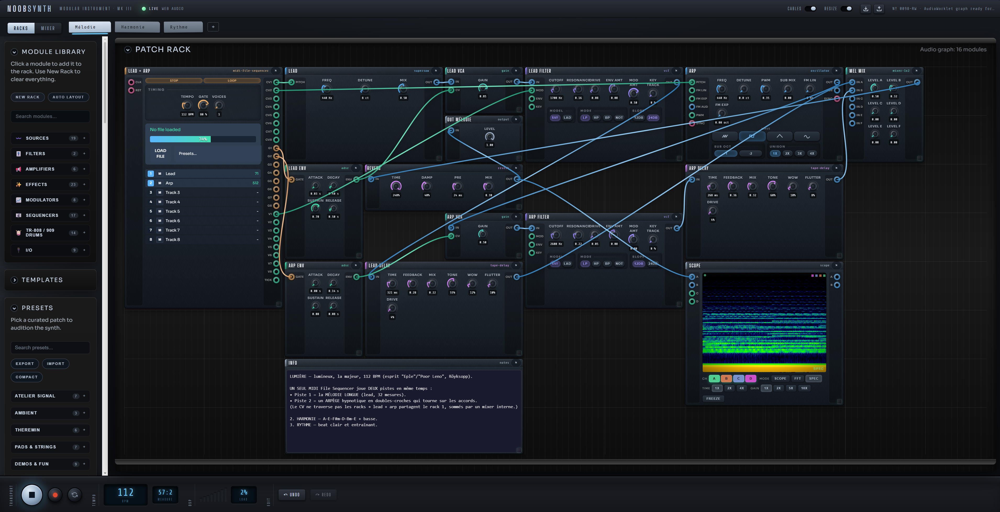

# NoobSynth3

Synthétiseur modulaire inspiré de VCV Rack, construit avec React + Rust/WASM.

**[Démo en ligne](https://ressources.warnotte.be/Projects/NoobSynth3/)**



## Caractéristiques

### Moteur Audio
- **93 modules DSP** : oscillateurs (VCO, Supersaw, FM, Karplus, Wavetable, Granular, Particle Cloud, Speech Synth, Theremin...), filtres (SVF/Ladder), effets (Reverb, Delay, Chorus, Leslie, Tube Amp, Glitch...), séquenceurs, drums TR-909/808, et plus
- **Polyphonie** : 1/2/4/8 voix avec voice stealing
- **Rust → WebAssembly** : DSP haute performance dans un AudioWorklet
- **2 modes** : Web Audio, Standalone (Tauri/WASAPI)

### Multi-Rack
- **Plusieurs racks** jouant simultanément (onglets)
- **Global Transport** : compteur de beats partagé, tous les séquenceurs synchronisés
- **Mixer Console** : volume/mute/solo par rack, master volume, VU meters temps réel
- **Channel Strip FX** : EQ 3 bandes + compresseur + reverb par canal, EQ/comp master — réglages persistés (restart transport + export projet)
- **Send/Receive** : routing audio inter-racks via 8 bus (A-H)
- **Master BPM** : tempo global dans la barre de transport

### Workflow
- **Module Templates** : sauvegarder/charger des groupes de modules pré-câblés
- **190+ presets** : Jupiter, Juno, Moog, Prophet, Jarre, Acid, Moroder, TR-909, Shepard, MIDI Organ, Vocal Synthesis...
- **Export/Import projet** : sauvegarder tous les racks + mixer + FX + tempo en un fichier
- **MIDI** : entrée Web MIDI avec vélocité
- **Undo/Redo** : historique avec transactions (knobs, modules)
- **Enregistrement WAV** : capture audio stéréo 16-bit

### Interface
- **Patchage visuel** : câbles colorés par type (audio/CV/gate/sync)
- **Grille modulaire** : layout automatique, drag & drop
- **Oscilloscope** intégré
- **CPU Meter** : charge DSP en temps réel

## Démarrage rapide

```bash
npm install
npm run build:wasm   # Requis après le premier clone
npm run dev
```

> **Note** : `build:wasm` nécessite Rust et wasm-bindgen. Voir [docs/DEVELOPMENT.md](docs/DEVELOPMENT.md) pour les prérequis.

Ouvrir l'app, cliquer **Play**, puis jouer avec le clavier ou charger un preset.

## Builds

| Commande | Résultat |
|----------|----------|
| `npm run dev` | Serveur de développement web |
| `npm run build` | Build production web |
| `npm run build:wasm` | Compiler Rust → WASM |
| `npm test` | Tests Rust (unit + presets) |
| `npm run tauri:dev` | App standalone (dev) |
| `build.bat` | Build complet (web + Tauri) |

## Multi-Rack : Guide rapide

1. Cliquer **+** à côté des onglets de rack pour ajouter un rack
2. Charger un preset dans chaque rack
3. Appuyer **Play** — tous les racks jouent simultanément
4. Basculer entre **Rack** et **Mixer** pour voir les faders/VU meters
5. Le **BPM** dans la barre de transport contrôle tous les séquenceurs
6. **Resync** remet tous les séquenceurs au beat 0
7. **Export** sauvegarde tout le projet (tous les racks + mixer)

## Documentation

| Document | Description |
|----------|-------------|
| [Architecture](docs/ARCHITECTURE.md) | Vue d'ensemble technique (2 modes) |
| [Développement](docs/DEVELOPMENT.md) | Guide de build et contribution |
| [Modules](docs/MODULES.md) | Référence des 93 modules DSP |
| [Roadmap](docs/ROADMAP.md) | Plan de développement |

## Licence

Pas de licence définie pour le moment. Tous droits réservés.
