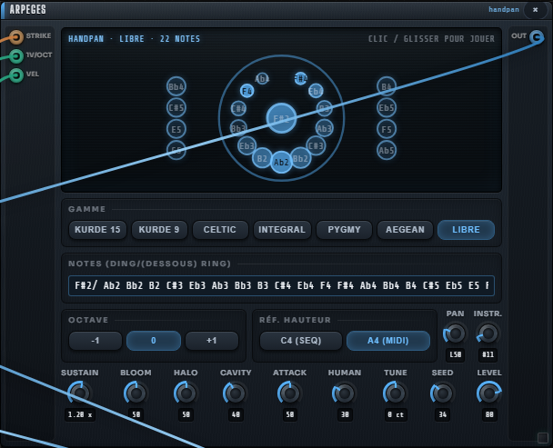
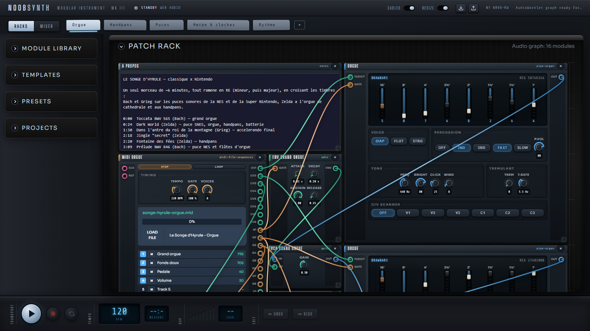

# Le handpan de NoobSynth3 et Le Songe d'Hyrule

> **🎧 [Écouter Le Songe d'Hyrule (MP3)](https://github.com/warnotte/NoobSynth3/releases/download/v0.17.0/Le-Songe-d-Hyrule.mp3)** ·
> **▶️ [L'ouvrir dans la démo en ligne](https://warnotte.github.io/NoobSynth3/?project=songe-hyrule)** (appuyer sur Play)

Le 100e module de NoobSynth3 est un **handpan** : un instrument en acier joué à la main, modélisé
par synthèse modale et calé sur des enregistrements réels. Autour de lui : des presets et projets MIDI qui
le mettent en scène, et **Le Songe d'Hyrule**, une pièce de 6 minutes qui mélange musique classique et
musiques de jeux Nintendo.

## Le Songe d'Hyrule

Un seul morceau, presque tout ramené en **ré** (mineur, puis majeur) : seule la Fontaine des fées garde sa tonalité d'origine, derrière le jingle « secret » qui lui sert de porte. Les mondes se croisent : Bach et Grieg
joués par les puces sonores de la NES et de la Super Nintendo, Zelda joué à l'orgue de cathédrale et aux
handpans.

| Début | Section | Instruments | Tonalité |
|------:|---------|-------------|----------|
| 0:00 | Toccata BWV 565 (Bach) | grand orgue, pédale 16' | ré mineur |
| 0:24 | Dark World (Zelda: A Link to the Past) | puce SNES, orgue, handpans, batterie | do m → ré m |
| 1:30 | Dans l'antre du roi de la montagne (Grieg) | puces NES, orgue, timbales — accelerando final | si m → ré m |
| 2:18 | Jingle « secret » (Zelda) | puce SNES, cloches | — |
| 2:20 | Fontaine des fées (Zelda) | 2 handpans, réglés comme le preset | tonalité d'origine |
| 3:09 | Prélude BWV 846 (Bach) | puce NES, flûtes d'orgue | do M → ré M |
| 3:44 | Gymnopédie n°1 (Satie) | handpans, flûtes d'orgue | ré majeur |
| 4:33 | Village Cocorico / Kakariko (Zelda) | handpans, shakuhachi SNES, cloches | si♭ M → ré M |
| 5:09 | Trumpet Voluntary (Clarke / Purcell) | puce SNES, grand orgue, handpans, marche | ré majeur |

**Dans l'app** : Projects → Songs → *Le Songe d'Hyrule 🏰*, ou directement par le lien
`?project=songe-hyrule`. Le projet a **5 racks**, un par famille (Orgue, Handpans, Puces, Harpe & cloches,
Rythme), avec un fader chacun dans la console MIXER.

**Comment c'est fait**
- Chaque rack a son séquenceur MIDI et son fichier (`Le Songe d'Hyrule - <rack>` dans le lecteur MIDI),
  arrangé par `scripts/songe-hyrule.mjs` à partir des MIDI déjà fournis avec l'app.
- La dernière piste de chaque fichier, « Volume », est une **automation** : la vélocité de ses notes règle
  le niveau du rack. C'est ce qui fait les fondus, les crescendos et les enchaînements entre les morceaux.
- Les ponts entre sections sont composés : roulements de timbales, pédale de ré, accord de dominante qui
  résout sur la Gymnopédie, ritardando final.
- Les volumes sont **calibrés au banc** (`scripts/songe-hyrule-calibrate.mjs`) : chaque section tombe à
  ±1 dB de sa cible, crête du mix 0,90.

## Les deux suites suivantes

Même mécanique que le Songe (un fichier MIDI par rack, piste « Volume » en automation, niveaux calibrés au
banc), avec les sources versionnées dans `scripts/sources/` pour que tout se régénère depuis le dépôt seul.

| Suite | Tableaux | Racks | Ouvrir |
|-------|----------|-------|--------|
| **Le Rêve de Dinosaur Land** 🍄 — Super Mario World (Koji Kondo) | Star Road sur la puce SNES, Overworld et Athletic aux handpans et à la harpe, carte de Donut Plains, Forest of Illusion, un château ténébreux à l'orgue et aux timbales, générique de fin | 6 | [▶️](https://warnotte.github.io/NoobSynth3/?project=reve-dinosaur) |
| **Les Deux Mondes d'Hyrule** 🗡️ — Zelda: A Link to the Past | prologue, thème du héros (Light World), fontaine des fées, Lost Woods, chute dans le Dark World, Ganon, générique | 6 | [▶️](https://warnotte.github.io/NoobSynth3/?project=deux-mondes) |
| **Les Deux Mondes d'Hyrule (orchestre)** 🎺 | mêmes tableaux ; trompettes (deux dents de scie dans un filtre ladder qui s'ouvre de trois octaves en 8 ms) et cordes (Ensemble) prennent fanfares, thèmes et harmonies ; handpans, harpe, SNES et orgue restent en couleur | 8 | [▶️](https://warnotte.github.io/NoobSynth3/?project=deux-mondes-orchestre) |

- Générateurs : `scripts/reve-dinosaur.mjs`, `scripts/deux-mondes.mjs` (`--orchestre` pour la variante) ;
  calibrage : `scripts/*-calibrate.mjs`. Ils écrivent dans `target/` par défaut, `--public` pour l'app.
- Les transcriptions MIDI ont été choisies objectivement : accord note à note entre transcriptions
  indépendantes du même thème (`scripts/sources/*/SOURCES.md`).
- Le calibrage des Deux Mondes lit la **crête stéréo par canal** (un instrument panoramisé fait monter
  un canal au-dessus du mix mono : 1,33 mesuré contre 0,90 en mono) et ne baisse que la section fautive.

## Le handpan

Un handpan D Kurde 15 notes (Ding D3, notes du dessous F3 G3), dans n'importe quelle gamme :
6 gammes intégrées ou une **gamme libre** écrite comme les fabricants (`D3/(F3 G3) A3 Bb3 C4…`, jusqu'à
32 zones). Toutes les zones vivent dans une seule coque qui résonne réellement : frapper une note fait
chanter ses voisines.

- **Joué** au gate + CV de hauteur (accords compris : chaque voix d'une source polyphonique frappe sa
  zone), ou **au clic / glisser** sur la coque à l'écran, dont les zones s'illuminent selon leur vibration.
- **Calé sur deux vrais instruments** (pack GAMEDRIX974, Hang FreePats), puis choisi à l'oreille contre
  la version précédente, à volume égal.

| Mesure | Instrument réel | v1 | v2 (actuelle) |
|--------|----------------:|---:|--------------:|
| Durée du claquement du doigt (−20 dB) | 25–31 ms | 2 ms | 23 ms |
| Couleur du claquement (centroïde) | 3,3–3,4 kHz | 13,5 kHz | 3,3 kHz |
| Écart stéréo fondamentale / octave | 3–6,5 dB | 0,9 dB | 5,3 dB |
| Octave du Ding D3 (justesse) | juste | +20,5 ct | +0,6 ct |

La fondamentale chute vite puis laisse sonner l'octave et la quinte. Une note frappée fort démarre ~8 cents
trop haut et se pose. Chaque partiel rayonne de sa propre zone de la coque. Au-dessus des notes, de très
faibles harmoniques aiguës et modes de coque font scintiller la frappe. Plusieurs handpans jouent
ensemble sans battre (accord entre exemplaires à ±2 cents).

Détails techniques : [MODULES.md → Handpan](MODULES.md#handpan).

## Presets à essayer

Chaque preset donne **un handpan par piste du fichier MIDI**, avec pour gamme libre les notes exactes de la
piste. Le fichier du lecteur MIDI est identique à celui du preset.

| Preset | Pistes | Ouvrir |
|--------|--------|--------|
| Handpan Kurde (démo du module) | séquenceur pas-à-pas | [▶️](https://warnotte.github.io/NoobSynth3/?preset=handpan-kurde) |
| Zelda · Fairy Fountain | 2 handpans, 4 voix | [▶️](https://warnotte.github.io/NoobSynth3/?preset=handpan-zelda-fairy) |
| Zelda · Kakariko | 8 handpans | [▶️](https://warnotte.github.io/NoobSynth3/?preset=handpan-zelda-kakariko) |
| Zelda · Dark World | 8 handpans | [▶️](https://warnotte.github.io/NoobSynth3/?preset=handpan-zelda-dark-world) |
| Super Mario World · Overworld | 8 handpans | [▶️](https://warnotte.github.io/NoobSynth3/?preset=handpan-smw-overworld) |
| Super Mario World · Athletic | 5 handpans | [▶️](https://warnotte.github.io/NoobSynth3/?preset=handpan-smw-athletic) |
| Satie · Gymnopédie n°1 | 2 handpans, 8 voix | [▶️](https://warnotte.github.io/NoobSynth3/?preset=handpan-satie-gymnopedie) |
| Aphex Twin · Avril 14th | 2 handpans, 8 voix | [▶️](https://warnotte.github.io/NoobSynth3/?preset=handpan-avril-14th) |
| Purcell · Trumpet Voluntary | 4 handpans | [▶️](https://warnotte.github.io/NoobSynth3/?preset=handpan-purcell-trumpet) |
| Monolithe / Lumière (compositions du projet) | 2 handpans | [▶️](https://warnotte.github.io/NoobSynth3/?preset=handpan-monolithe) |

Projets multi-rack (Projects → Handpan) : Kakariko et Dark World en orchestre, Fairy Fountain et
Avril 14th en 2 racks.

**Partager un projet** : charger un projet depuis la section Projects met l'adresse à jour
(`?project=<id>`) : il suffit de la copier.

## Crédits

Musiques originales : Johann Sebastian Bach, Edvard Grieg, Erik Satie, Jeremiah Clarke (domaine public) ;
Koji Kondo (Nintendo) ; Aphex Twin. Les fichiers MIDI viennent des séquenceurs mentionnés dans les fichiers
eux-mêmes. Super Mario World : transcriptions de SevenChaos (Overworld) et AI Musicware Branch (Athletic),
publiées sur VGMusic, choisies parmi onze parce que des transcriptions indépendantes y retrouvent 83 à 97 %
des mêmes notes ; la piste de batterie « Yoshi » d'Athletic est retirée. Références sonores du handpan : pack GAMEDRIX974 (freesound, CC0), Hang FreePats (CC0).
